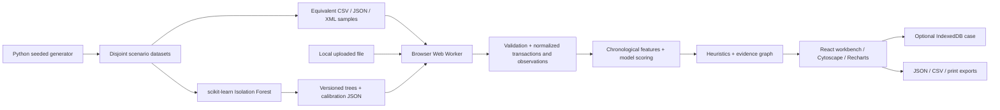

# Architecture

Trace Ledger is a **browser application with a local analysis engine and an offline Python training pipeline**. Model fitting is a build-time activity, not a hosted API.

## Module boundaries

- `pipeline/generate.py`: deterministic synthetic UTXO creation, independent scenario labels, three encodings.
- `pipeline/train.py`: pure feature extraction, reference selection, fit, tree export, score vectors and measured evaluation.
- `src/ingest.ts`: format parsers, mapping, timestamp/IP/port/amount checks, source provenance, conflict and UTXO validation, raw-file SHA-256.
- `src/engine.ts`: chronological features, faithful Isolation Forest path traversal, fixed percentile, graph edges, heuristics, seed propagation, graph selection and path search.
- `src/worker.ts`: typed-data messages for preview, ingest, analyze, bounded graph and path queries. No DOM operations or outbound network calls.
- `src/main.tsx`: seven-section React workbench, loading/error/empty states, worker request lifecycle, review forms and orchestration.
- `src/Graph.tsx`: Cytoscape locally bundled renderer, selection, filters and exports. Force layout is bounded to the visible graph and runs inside the renderer on the main thread; construction/traversal/filter calculations run in the worker.
- `src/cases.ts`: portable case representation, CSV escaping, Blob downloads and IndexedDB failure handling.
- `src/geo.ts`: local CIDR validation/longest-prefix lookup. Optional enrichment is a user-triggered lookup, not a remote service or automatic attribution.

## State and concurrency

React holds the current completed analysis in memory. File text is sent to one dedicated worker; parsing, transaction validation, hashing, features, scores and graph construction happen there. Milestone progress is reported for actual phases (not timed animation). Cancelling terminates and replaces the worker, rejects pending work, resets the staged import and leaves a previously completed result available. There is no server session or shared investigation state. IndexedDB is the intentional exception: explicitly saved cases can be restored by other tabs on the same browser origin.

Saving is explicit. Reload opens an empty workspace; Restore saved case loads the last saved case. Editing notes is not autosaved. Export is independent of storage availability. A case import revalidates its normalized transactions and observations and regenerates scores with the bundled matching model version. The original raw-file hash is retained as **claimed source provenance**, not re-authenticated. SHA-256 identifies source bytes, so equivalent CSV/JSON/XML imports have different file hashes but identical normalized data and scores.

## Accounting and graph semantics

Safe integer satoshis are validated at every amount and transaction aggregate. BigInt is used for conservation comparisons and whole-dataset sums; totals serialize as decimal strings. Repeated observations never multiply a transaction's amounts. Gross output totals include funding boundary and all forwarding; they are not a wallet balance.

Edges are only created from supplied participation, validated explicit outpoints, actual relay observations, or visibly labelled inferred common-input groups. No timing-based origin inference and no graph embedding are implemented. Network correlation joins a supplied observation TXID to the unique transaction and retains IP/port/time evidence. Timing ranges are supporting observations; clocks may be uncertain.

## Runtime and security boundary

Vite emits static assets with relative paths. No runtime CDNs, telemetry, remote APIs or backend are used. Python's stdlib server binds loopback. `serve.py` adds a self-only CSP for connections/scripts/workers, disallows objects and sets no-referrer/nosniff. DTD/entities are rejected before XML parsing. React escapes imported strings. CSV text prefixes are escaped. Files are capped at 50 MiB/50,000 records; graph rendering at 180 nodes/1,200 total elements. Local case files have a 50 MiB import limit. Browser memory usage limits may still be reached on constrained devices; parsing is not streaming.

Hosted sessions require the host only to load static assets. Runtime privacy depends on serving this audited build from a trusted origin; this prototype does not claim forensic custody or endpoint hardening. An optional feature-detected WebMCP tool only navigates workbench sections; it exposes no uploaded records. Unsupported browsers ignore it.
